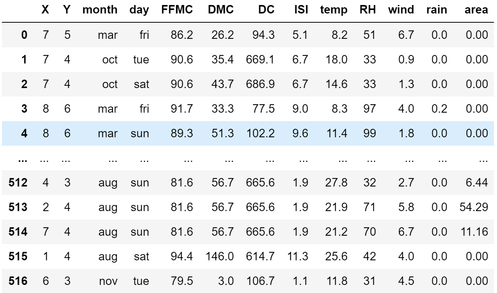

# UCI Dataset Readme
This dataset consists of wildfire data from 2000 to 2003 in Montesinho National Park in northeast Portugal. It is present as a CSV-type file and consists of 517 entries with 13 
features, including spatial coordinates within the park, month, day, temperature, humidity, rain, and area (in hectares). Some codes defined by the Fire Weather Index include the Fine Fuel Moisture Code (FFMC), which represents fuel moisture of forest litter fuels under the shade of a forest canopy with values from 0 to 101; the Duff Moisture Code (DMC), which represents fuel moisture of decomposed organic material underneath the litter with limitless value; the Drought Code (DC), which represents drying deep into the soil with a maximal value of 1000; the Initial Spread Index (ISI), which integrates fuel moisture for fine dead fuels and surface windspeed to estimate a spread potential with limitless values; and Relative Humidity (RH), which exists as a percent from 0 to 100. Due to the multitude of diverse features, dimensionality reduction and feature selection is important when working with this dataset. Analyses using this source of data should follow a regression model predicting the output variable
(area).

